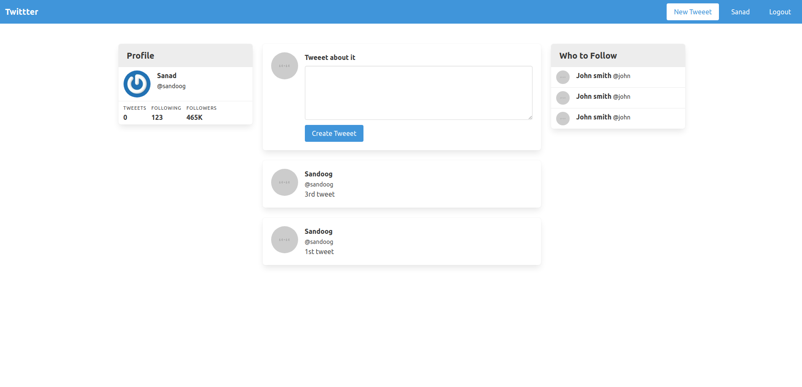

##  Twitter clone 

In this project I built a Twitter clone, both using nearly-pure HTML and then graduating to using the helper methods that Rails provides and authentication.



## Build With

- Ruby 2.7.0p0
- Ruby on Rails 5.2.4.4

### Setup
 - Open a terminal
 - Copy this code : 
        ```
        git@github.com:sanadwj/twittter-clone.git
        ```


## Author


👤 **Sanad Walid Abujbara**

- Github: [@sanadwj](https://github.com/githubhandle)
- Twitter: [@sandooog](https://twitter.com/sandooog)
- Linkedin: [sanad-abujbara](https://linkedin.com/in/sanad-abujbara)

## 🤝 Contributing

Contributions, issues and feature requests are welcome!

## Show your support .

Give a ⭐️ if you like this project!

## Acknowledgments

- Microverse Team 139 (The Thanatos)

## 📝 License

This project is [MIT](lic.url) licensed.

